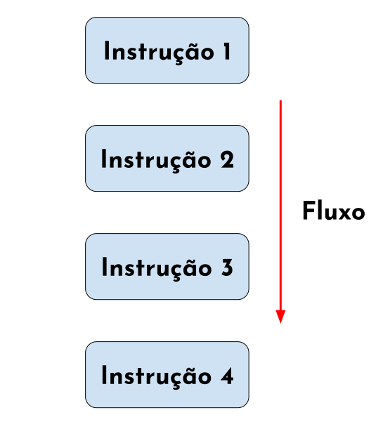

<!--Don't delete this script-->
<script src = "https://polyfill.io/v3/polyfill.min.js?features=es6"></script>
<script id = "MathJax-script" async src="https://cdn.jsdelivr.net/npm/mathjax@3/es5/tex-mml-chtml.js"></script>
<!--Don't delete this script-->

<h1>Crotolando o fluxo do algoritmo</h1>

<p align = "justify">
Durante o processo de programação, é comum nos depararmos com a necessidade de executar determinada parte do bloco de código somente caso uma condição espeficia seja atendida. Nestes casos, faz-se necessário utilizar estruturas da linguaguem de programação que permitam realizar essas verificações de fluxo.
<br><br>
As principais estruturas de controle são:
</p>

<ul>
  <li>Estrutura sequencial;</li>
  <li>Estrutura condicional;</li>
  <li>Estrutura de repetição.</li>
</ul>

<h1>Estrutura sequencial</h1>

<p align = "justify">
A estrutura sequencial é a mais básica das estruturas. As instruções são executadas em sequência linear obdecendo as identações da linguagem Python. A <a href = "#fig41">Figura 4.1</a> apresenta o fluxo de funcionamento desta estrutura sequencial.
</p>

<p align = "left" id = "fig41"><b>Figura 4.1.</b> Representação estrutural sequencial.</p>
<center></center>

<p align = "justify">
Vejamos um exemplo:
</p>

```python
h = 50                        # instrução 1
j = 20                        # instrução 2
x = 10                        # instrução 3
media = (x + j + x) / 3       # instrução 4
print('valor médio: ', media) # instrução 5
```
```cmd
valor médio:  13.333333333333334
```

<p align = "justify">
Na sequência vamos avliar os outros padrões de controle de fluxo de um algoritmo em linguagem Python.
</p>

{: .highlight }
> Como citar
> 
> PEREIRA JUNIOR, Wanderlei Malaquias; SEABRA, Eduardo Veloso Manhães; DE OLIVEIRA, Jessyca Batista Marques; RODRIGUES, Murilo Carneiro. Python: Introdução a linguagem. 1. ed. Catalão, 2023. (Curso de Python). Disponível em: <10.5281/zenodo.8352294>.