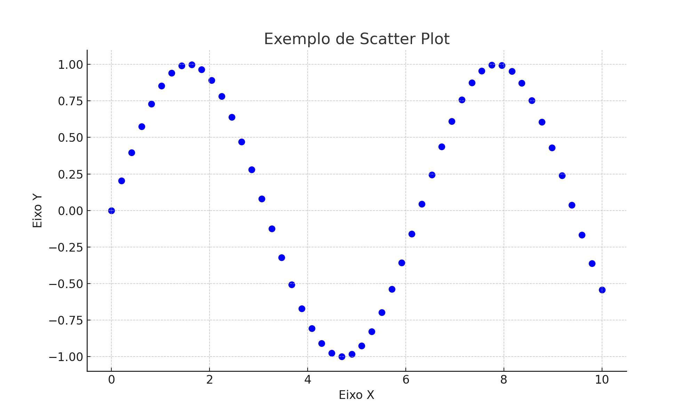
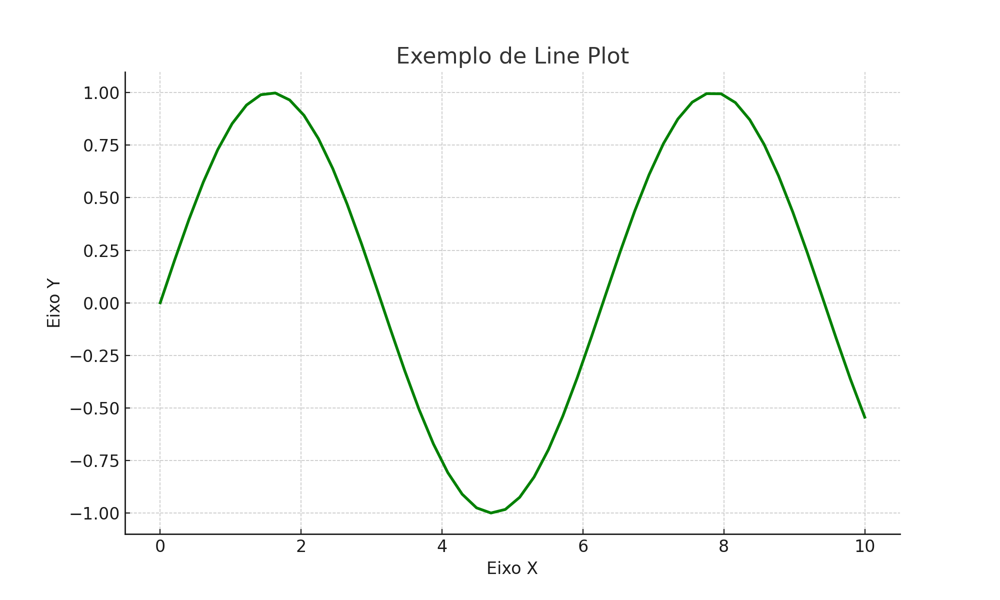
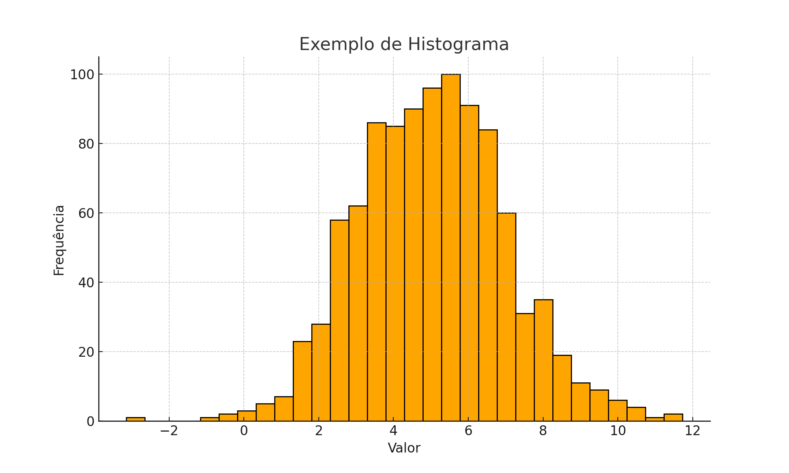

# Como Criar Gráficos com Matplotlib

Esta seção irá ensinar a criar gráficos com a biblioteca `matplotlib.pyplot` do Python.

---

## Como montar um gráfico

Para começar, importe o matplotlib e crie seus dados:

```python
import matplotlib.pyplot as plt
import numpy as np

x = np.linspace(0, 10, 100)
y = np.sin(x)
```

Agora, crie o gráfico com a função correspondente:

```python
plt.plot(x, y)  # ou plt.scatter(x, y), plt.hist(data), etc.
plt.show()
```

---

## Edição dos Eixos

Você pode personalizar os eixos com:

```python
plt.xlabel("Nome do eixo X")
plt.ylabel("Nome do eixo Y")
plt.title("Título do gráfico")
```

Também é possível ajustar os limites dos eixos:

```python
plt.xlim(0, 10)
plt.ylim(-1, 1)
```

---

## Cores, Tamanhos e Estilos

- Cor: `color='red'`, `color='blue'`
- Estilo de linha: `linestyle='--'` (tracejada), `'-'` (contínua)
- Marcadores: `marker='o'`, `'s'`, `'^'` etc.
- Espessura da linha: `linewidth=2`

```python
plt.plot(x, y, color='green', linestyle='--', linewidth=2, marker='o')
```

---

## Legendas

Adicione uma legenda usando:

```python
plt.plot(x, y, label='Seno')
plt.legend()
```

---

## Exemplos Práticos

Abaixo estão três tipos comuns de gráfico usando `matplotlib` e a sua visualização.

---

### 1. Scatter Plot

```python
import matplotlib.pyplot as plt
import numpy as np

x = np.linspace(0, 10, 50)
y = np.sin(x)

plt.scatter(x, y, color='blue', marker='o')
plt.title('Exemplo de Scatter Plot')
plt.xlabel('Eixo X')
plt.ylabel('Eixo Y')
plt.grid(True)
plt.show()
```

<p align="left" id="fig122-0"><b>Figura 1.</b> Exemplo de Scatter Plot</p>

<center>
    
</center>

---

### 2. Line Plot

```python
import matplotlib.pyplot as plt
import numpy as np

x = np.linspace(0, 10, 50)
y = np.sin(x)

plt.plot(x, y, color='green', linestyle='-', linewidth=2)
plt.title('Exemplo de Line Plot')
plt.xlabel('Eixo X')
plt.ylabel('Eixo Y')
plt.grid(True)
plt.show()
```

<p align="left" id="fig122-0"><b>Figura 2.</b> Exemplo de Line Plot</p>

<center>
    
</center>

---

### 3. Histograma

```python
import matplotlib.pyplot as plt
import numpy as np

data = np.random.normal(loc=5.0, scale=2.0, size=1000)

plt.hist(data, bins=30, color='orange', edgecolor='black')
plt.title('Exemplo de Histograma')
plt.xlabel('Valor')
plt.ylabel('Frequência')
plt.grid(True)
plt.show()
```

<p align="left" id="fig122-0"><b>Figura 3.</b> Exemplo de Histograma</p>

<center>
    
</center>

---
