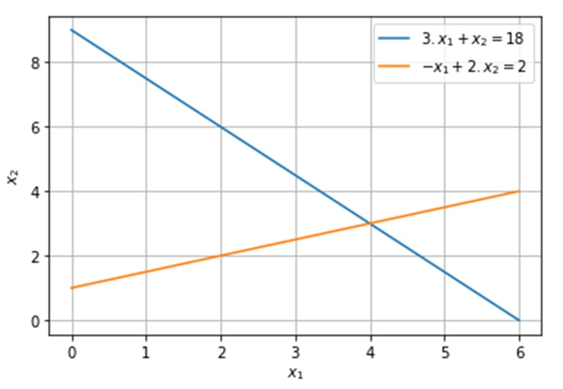
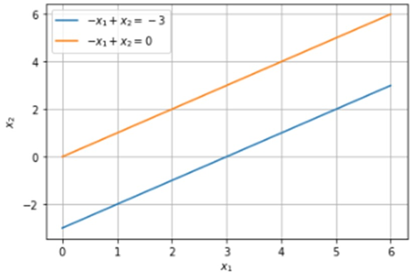
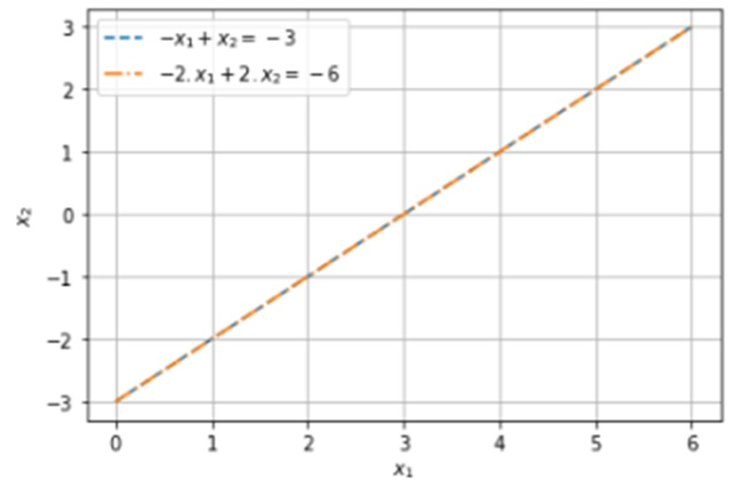

<!--Don't delete ths script-->

<!--Don't delete ths script-->

## Sistemas de equações 

Em diversos problemas no campo das ciências aplicadas é comum a escrita das informações do problema **por meio das equações**. Sendo que estas equações podem interagir, serem complementares entre outras possibilidades.

Sabendo que uma **equação** é uma **expressão algébrica de igualdade entre variáveis** é essencial que se conheça maneiras de resolver este tipo de equação ou sistema de equações. Portanto esse capítulo tem como foco o aprendizado de técnicas numéricas que permitam a resolução de sistemas de equações.

## Exemplos de possíveis sistemas de equações:
* Sistemas de equações lineares;

* Sistemas de equações não-lineares;

* Sistema de equações diferenciais.

* Sistemas de equações integrais.

## Os sistemas lineares 

Antes de iniciarmos o processo de entendimento dos modelos possíveis para solução de um sistema de equações é necessário compreender como é o formato de uma equação linear.

$$
a_1 \cdot x_1 + a_2 \cdot x_2 + \cdots + a_{n-1} \cdot x_{n-1} + a_n \cdot x_n = b \tag{1}
$$

Onde: \[a_1,… ,a_n\] representam os coeficientes (Conjunto dos R); \[x_1,… ,x_n\] representam as variáveis; e b o termo independente da equação linear. De uma forma geral podemos escrever que um sistema linear é representado pela equação (2). Neste caso *A* pode ser representado por uma matriz de coeficientes e também conhecido como o operador de transformação linear, *x* é o vetor que contém as informações que se deseja determinar *b* e o vetor de termos independentes.

$$ A \cdot x = b \tag{2} $$

$$
\begin{cases}
3 \cdot x_1 + 2 \cdot x_2 = 18 \\
-1 \cdot x_1 + 2 \cdot x_2 = 2^{1}
\end{cases}
\tag{4}
$$

$$
\begin{bmatrix} 3 & 2 & 18 \\ -1 & 2 & 2 \end{bmatrix} \quad
A = \begin{bmatrix} 3 & 2 \\ -1 & 2 \end{bmatrix} \quad
x = \begin{bmatrix} x_1 \\ x_2 \end{bmatrix} \quad
b = \begin{bmatrix} 18 \\ 2 \end{bmatrix}
$$

\[^{1}\] Equação homogênea é aquela onde o termo independente \[b = 0\].

## Solução gráfica do sistema de equações

Chapra [1] afirma que o método gráfico é uma “boa” forma de resolver conjunto de equações de pequena ordem \[(n ≤ 3)\]. Pois em um sistema de equações \[n × n\] cada equação representa um plano de dimensão \[n-1\] inserido no \[R^n\].

No exemplo anterior escrever as equações em termos de \[x_2\]:

$$
\begin{cases}
x_2 = - \frac{3}{2} + 9x_2 = \frac{1}{2}x_1 + 1 \\
x_2 = \frac{1}{2} x_1 + 1
\end{cases}
\tag{4}
$$

<b>Figura 1.</b> Solução gráfica do conjunto de duas equações (sistema possível e determinado).

    

<b>Figura 2.</b> Solução gráfica para um sistema impossível.

    

<b>Figura 3.</b> Solução gráfica para um sistema possível e indeterminado.

    

