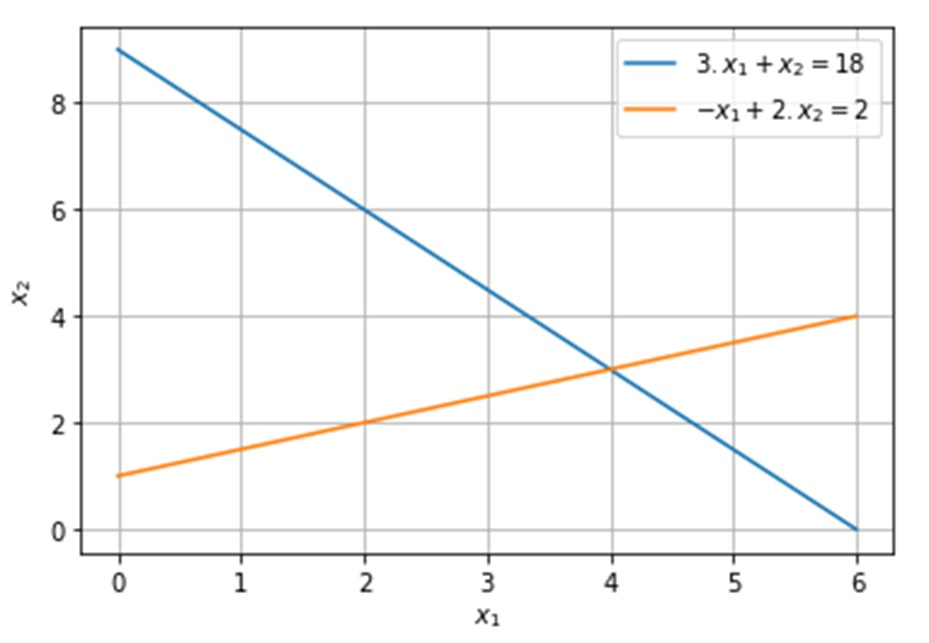

<!--Don't delete ths script-->

<!--Don't delete ths script-->

<h1> Condição de existência da solução</h1>

A primeira condição que devemos nos atentar é se o sistema possui uma única solução como visto anteriormente. Umas das maneiras de observar tal condição é o uso de determinantes. 
  
Para que o <b>sistema seja solucionável</b> a <b>matriz A</b> não pode ser singular, ou seja, se o seu <b>determinante deve ser diferente de zero</b>.

<h1>Operações elementares</h1>

Os <b>métodos diretos</b> de maneira geral trabalharam com <b>operações elementares</b> sobre as equações do sistema permitindo que após um determinado <b>número finito de operações</b> a <b>solução do sistema possa ser encontrada</b>.

<head>
    <meta charset="UTF-8">
    <meta name="viewport" content="width=device-width, initial-scale=1.0">
    
</head>
<body>
    <table>
        <tbody>
            <tr>
                <td>Permutação de linhas do sistema de equações</td>
                <td class="formula">Li ⟷ Lj</td>
            </tr>
            <tr>
                <td>Multiplicação de uma equação por uma constante não nula</td>
                <td class="formula">Li ⟵ k ⋅ Li</td>
            </tr>
            <tr>
                <td>Adicionar ou subtrair um múltiplo de uma equação a uma outra</td>
                <td class="formula">Lj ⟵ k ⋅ Li + Lj</td>
            </tr>
        </tbody>
    </table>
</body>

Para entender um pouco mais sobre as operações elementares imaginemos o seguinte sistema de equações:

<head>
    <meta charset="UTF-8">
    <meta name="viewport" content="width=device-width, initial-scale=1.0">
    
</head>
<body>
    <table>
        <tbody>
            <tr>
                <td>\(
                    2 \cdot x_1 - 3 \cdot x_2 = -8
                    \)
                </td>
            <tr>
                <td>\(
                3 \cdot x_1 + 4 \cdot x_2 = 5
                \)
                </td>
            <tr>
                <td>\(
                    A = <b>\begin{bmatrix} 2 & -3 \\ 3 & 4 \end{bmatrix}</b> Fazendo o determinante <b>|A| = 17 ≠ 0. Sistema Possível </b>.
                    \)
                </td>
            </tr>
        </tbody>
    </table>
</body>

<b>Figura 1.</b> Solução gráfica do conjunto de duas equações (sistema possível e determinado).

    

