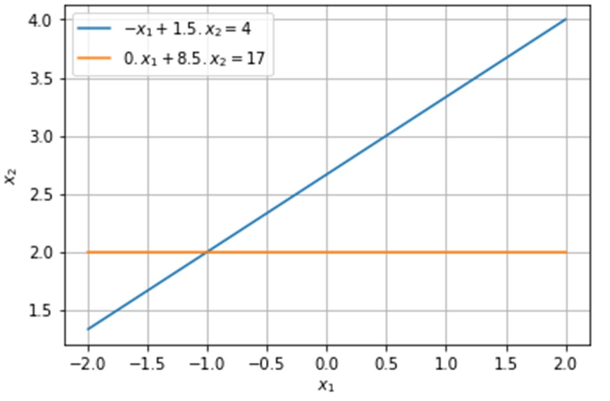

<!--Don't delete ths script-->

<!--Don't delete ths script-->

<h1> Condição de existência da solução</h1>

A primeira condição que devemos nos atentar é se o sistema possui uma única solução como visto anteriormente. Umas das maneiras de observar tal condição é o uso de determinantes. 
  
Para que o <b>sistema seja solucionável</b> a <b>matriz A</b> não pode ser singular, ou seja, se o seu <b>determinante deve ser diferente de zero</b>.

<h1>Operações elementares</h1>

Os <b>métodos diretos</b> de maneira geral trabalharam com <b>operações elementares</b> sobre as equações do sistema permitindo que após um determinado <b>número finito de operações</b> a <b>solução do sistema possa ser encontrada</b>.

<head>
    <meta charset="UTF-8">
    <meta name="viewport" content="width=device-width, initial-scale=1.0">
    
</head>
<body>
    <table>
        <tbody>
            <tr>
                <td>Permutação de linhas do sistema de equações</td>
                <td class="formula">\(L_i \leftrightarrow L_j\)</td>
            </tr>
            <tr>
                <td>Multiplicação de uma equação por uma constante não nula</td>
                <td class="formula">\(L_i \leftarrow k \cdot L_i\)</td>
            </tr>
            <tr>
                <td>Adicionar ou subtrair um múltiplo de uma equação a uma outra</td>
                <td class="formula">\(L_j \leftarrow k \cdot L_i + L_j\)</td>
            </tr>
        </tbody>
    </table>
</body>

Para entender um pouco mais sobre as operações elementares imaginemos o seguinte sistema de equações:

<table>
    <tbody>
        <tr>
            <td>\(
                2 \cdot x_1 - 3 \cdot x_2 = -8
            \)</td>
        </tr>
        <tr>
            <td>\(
                3 \cdot x_1 + 4 \cdot x_2 = 5
            \)</td>
        </tr>
        <tr>
            <td>\(
                A = \begin{bmatrix} 2 & -3 \\ 3 & 4 \end{bmatrix} 
                \quad \text{Fazendo o determinante} \quad |A| = 17 \neq 0.
                \quad \text{Sistema Possível}
            \)</td>
        </tr>
    </tbody>
</table>

<b>Figura 1.</b> Solução gráfica do conjunto de duas equações (sistema possível e determinado).

    

Aplicando uma operação elementar tipo 2:

<table>
    <tbody>
        <tr>
            <td>\(k \cdot 2 \cdot x_1 - 3 \cdot x_2)=k \cdot (-8)\)</td>
            <td class="formula">Exemplo k = 8,5 não alteraria a linha 1 por exemplo.</td>
        </tr>
    </tbody>
</table>

Agora vamos a uma sequência de operações para transformação do sistema:

<table>
    <tbody>
        <tr>
            <td>\(L_1 \leftarrow -\frac{1}{2} \cdot L_1\) 
            e 
            \(L_2 \leftarrow 3 \cdot L_1 + L_2\)
            </td>
        </tr>
        <tr>
            <td>\(
                \begin{bmatrix} 2 & -3 & -8 \\ 3 & 4 & 5 \end{bmatrix} 
                \rightarrow 
                \begin{bmatrix} -1 & 1.5 & 4 \\ 3 & 4 & 5 \end{bmatrix} 
                \rightarrow 
                \begin{bmatrix} -1 & 1.5 & 4 \\ 0 & 8.5 & 17 \end{bmatrix}
            \)</td>
        </tr>
    </tbody>
</table>

Obtendo a visualização gráfica do problema.

<b>Figura 2.</b> Solução gráfica do conjunto de duas equações após as operações elementares.

    

<h1>Sistemas triangulares</h1>

A <b>matriz de coeficientes</b> apresenta uma <b>forma triangular</b>, seja ele <b>superior</b> ou <b>inferior</b>:

<table>
    <tbody>
        <tr>
            <td>\(
                \begin{cases}
                a_{11} \cdot x_1 + a_{12} \cdot x_2 + a_{13} \cdot x_3 + ... + a_{1n} \cdot x_n = b_1 \\
                a_{22} \cdot x_2 + a_{23} \cdot x_3 + ... + a_{2n} \cdot x_n = b_2
                \\
                a_{33} \cdot x_3 + ... + a_{3n} \cdot x_n = b_3
                \\
                ...
                \\
                a_{nn} \cdot x_n = b_n
                \end{cases}
                \)
            </td>
            <td class="tag">(1)</td>
        </tr>
    </tbody>
</table>

Após a <b>formação do sistema superior ou inferior</b> é possível <b>determinar<\b> o valor do <b>vetor solução</b>:

<table>
    <tbody>
        <tr>
            <td>\(
                x_n = \frac{b_n}{ann}
                \)</td>
            <td class="tag">(2)</td>
        </tr>
        <tr>
            <td>\(
                x_{n-1} = \frac{b_{n-1} - a_{(n-1)n} \cdot x_n}{a_{(n-1)(n-1)}}
                \)
            </td>
            <td class="tag">(3)</td>
        </tr>
    </tbody>
</table>