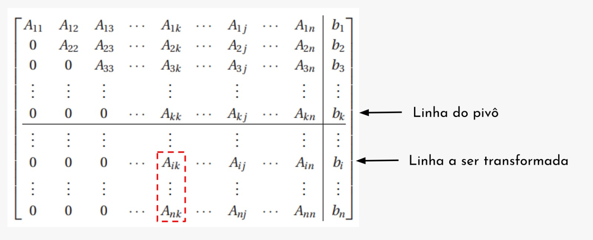

<!--Don't delete ths script-->

<!--Don't delete ths script-->

<h1> Condição de existência da solução</h1>

A primeira condição que devemos nos atentar é se o sistema possui uma única solução como visto anteriormente. Umas das maneiras de observar tal condição é o uso de determinantes. 
  
Para que o <b>sistema seja solucionável</b> a <b>matriz A</b> não pode ser singular, ou seja, se o seu <b>determinante deve ser diferente de zero</b>.

<h1>Operações elementares</h1>

Os <b>métodos diretos</b> de maneira geral trabalharam com <b>operações elementares</b> sobre as equações do sistema permitindo que após um determinado <b>número finito de operações</b> a <b>solução do sistema possa ser encontrada</b>.

<head>
    <meta charset="UTF-8">
    <meta name="viewport" content="width=device-width, initial-scale=1.0">
    
</head>
<body>
    <table>
        <tbody>
            <tr>
                <td>Permutação de linhas do sistema de equações</td>
                <td class="tag">\(L_i \leftrightarrow L_j\)</td>
            </tr>
            <tr>
                <td>Multiplicação de uma equação por uma constante não nula</td>
                <td class="tag">\(L_i \leftarrow k \cdot L_i\)</td>
            </tr>
            <tr>
                <td>Adicionar ou subtrair um múltiplo de uma equação a uma outra</td>
                <td class="tag">\(L_j \leftarrow k \cdot L_i + L_j\)</td>
            </tr>
        </tbody>
    </table>
</body>

Para entender um pouco mais sobre as operações elementares imaginemos o seguinte sistema de equações:

<table>
    <tbody>
        <tr>
            <td>\(
                2 \cdot x_1 - 3 \cdot x_2 = -8
            \)</td>
        </tr>
        <tr>
            <td>\(
                3 \cdot x_1 + 4 \cdot x_2 = 5
            \)</td>
        </tr>
        <tr>
            <td>\(
                A = \begin{bmatrix} 2 & -3 \\ 3 & 4 \end{bmatrix} 
                \quad \text{Fazendo o determinante} \quad |A| = 17 \neq 0.
                \quad \text{Sistema Possível}
            \)</td>
        </tr>
    </tbody>
</table>

<b>Figura 1.</b> Solução gráfica do conjunto de duas equações (sistema possível e determinado).

    

Aplicando uma operação elementar tipo 2:

<table>
    <tbody>
        <tr>
            <td>\(k \cdot 2 \cdot x_1 - 3 \cdot x_2)=k \cdot (-8)\)</td>
            <td class="tag">Exemplo k = 8,5 não alteraria a linha 1 por exemplo.</td>
        </tr>
    </tbody>
</table>

Agora vamos a uma sequência de operações para transformação do sistema:

<table>
    <tbody>
        <tr>
            <td>\(L_1 \leftarrow -\frac{1}{2} \cdot L_1\) 
            e 
            \(L_2 \leftarrow 3 \cdot L_1 + L_2\)
            </td>
        </tr>
        <tr>
            <td>\(
                \begin{bmatrix} 2 & -3 & -8 \\ 3 & 4 & 5 \end{bmatrix} 
                \rightarrow 
                \begin{bmatrix} -1 & 1.5 & 4 \\ 3 & 4 & 5 \end{bmatrix} 
                \rightarrow 
                \begin{bmatrix} -1 & 1.5 & 4 \\ 0 & 8.5 & 17 \end{bmatrix}
            \)</td>
        </tr>
    </tbody>
</table>

Obtendo a visualização gráfica do problema.

<b>Figura 2.</b> Solução gráfica do conjunto de duas equações após as operações elementares.

    

<h1>Sistemas triangulares</h1>

A <b>matriz de coeficientes</b> apresenta uma <b>forma triangular</b>, seja ele <b>superior</b> ou <b>inferior</b>:

<table>
    <tbody>
        <tr>
            <td>\(
                \begin{cases}
                a_{11} \cdot x_1 + a_{12} \cdot x_2 + a_{13} \cdot x_3 + ... + a_{1n} \cdot x_n = b_1 \\
                a_{22} \cdot x_2 + a_{23} \cdot x_3 + ... + a_{2n} \cdot x_n = b_2
                \\
                a_{33} \cdot x_3 + ... + a_{3n} \cdot x_n = b_3
                \\
                ...
                \\
                a_{nn} \cdot x_n = b_n
                \end{cases}
                \)
            </td>
            <td class="tag">(1)</td>
        </tr>
    </tbody>
</table>

Após a <b>formação do sistema superior ou inferior</b> é possível <b>determinar</b> o valor do <b>vetor solução</b>:

<table>
    <tbody>
        <tr>
            <td>\(
                x_n = \frac{b_n}{ann}
                \)</td>
            <td class="tag">(2)</td>
        </tr>
        <tr>
            <td>\(
                x_{n-1} = \frac{b_{n-1} - a_{(n-1)n} \cdot x_n}{a_{(n-1)(n-1)}}
                \)
            </td>
            <td class="tag">(3)</td>
        </tr>
    </tbody>
</table>

Fazendo o caso geral para a forma triangular superior:
</b>

<table>
    <tbody>
        <tr>
            <td>\(
               x_i = \frac{b_i - \sum_{j = i+1}^{n} f a_{ij} \cdot x_j}{a_{ii}}
                \)</td>
            <td class="tag">(4)</td>
        </tr>
    </tbody>
</table>

Para um sistema triangular inferior:
</b>

<table>
    <tbody>
        <tr>
            <td>\(
                x_i = \frac{b_i - \sum_{j = i+1}^{i-1} f a_{ij} \cdot x_j}{a_{ii}}
                \)</td>
            <td class="tag">(5)</td>
        </tr>
    </tbody>
</table>

<h1>Exemplo a</h1>

Considere o exemplo para emprego da formulação de sistemas triangulares onde será determinado o vetor solução do sistema linear informado. Considere que o mesmo já foi verificado quanto a existência de uma solução.
</b>

$$
\begin{cases}
    2 \cdot x_1 + x_2 + x_3 = 11 \\
    x_2 - x_3 = 1 \\
    2 \cdot x_3 = 4
\end{cases}
$$

<h2>Solução manual do exemplo a)</h2>

Montagem da matriz aumentada \([A|B]\)

\(\begin{bmatrix} 
    2 & 1 & 3 & 11 \\
        & 1 & -1 & 1 \\
        &   &  2 & 4
\end{bmatrix}\)

<table>
    <tbody>
        <tr>
            <td><b>Iteração \(k = 1\) \(i = 3\)</b></td>
        </tr>
        <tr>
            <td>\(
                x_3 = \frac{b_3 - \sum{a_{ij} \cdot x_j}}{a_{33}}
            \)</td>
            <td>\(
                x_3 = \frac{4}{2} = 2
            \)</td>
        </tr>
        <tr>
            <td><b>Iteração \(k = 2\) \(i = 2\)</b></td>
        </tr>
        <tr>
            <td>\(
                x_2 = \frac{b_2 - (a_{23} \cdot x_3)}{a_{22}}
            \)</td>
            <td>\(
                x_2 = \frac{1 - (-1 \cdot 2)}{1} = 3
            \)</td>
        </tr>
        <tr>
            <td><b>Iteração \(k = 3\) \(i = 1\)</b></td>
        </tr>
        <tr>
            <td>\(
                x_1 = \frac{b_1 - (a_{12} \cdot x_2 + a_{13} \cdot x_3)}{a_{11}}
            \)</td>
            <td>\(
                x_1 = \frac{11 - (1 \cdot 3 + 3 \cdot 2)}{2} = 1
            \)</td>
        </tr>
        <tr>
            <td>\( x =
                \begin{bmatrix}
                    1 \\ 2 \\ 3 
                \end{bmatrix}
            \)</td>
        </tr>
    </tbody>
</table>

Conforme o exercício acima é possível criar o pseudocódigo do modelo triangular superior:

    

        1
        \( x = \frac{b_n}{a_{nn}} \)
    

    

        2
        para \( i = (n - 1) \) até 1
    

    

        3
        soma = 0
    

    

        4
        para \( j = (i + 1) \) até \( n \)
    

    

        5
        soma = soma + \( a_{ij} \cdot x_j \)
    

    

        6
        \( x_i = \frac{b_i - \text{soma}}{a_{ii}} \)
    

<h1>Eliminação Gaussiana</h1>

O primeiro método de solução de sistemas consiste em <b>transformar</b> o <b>sistema de equações lineares em um modelo triangular</b> e a partir desse modelo é possível aplicar os algoritmos vistos anteriormente.
  
Para este processo de <b>eliminação progressiva</b> vamos <b>empregar o conceito de pivô</b> que um elemento escolhido para fazer a <b>transformação</b> de uma determinada <b>linha</b>. Chamaremos essa linha “especial” de linha do pivô. A ideia básica é que possamos chegar a um <b>sistema</b> semelhante ao da <b>equação (1)</b>.
  
A <b>Figura 3</b> ilustra o processo de <b>eliminação progressiva</b>. Basicamente será aplicada uma <b>operação elementar</b> sobre a <b>linha subsequente ao pivô</b>, no caso deste exemplo <b>linha \(i\)</b>.

<table>
    <tbody>
        <tr>
            <td>Pivô</td>
            <td class="tag">\(m_{ik} = \frac{a_{ik}}{a_{kk}}\)</td>
        </tr>
        <tr>
            <td>Adicionar ou subtrair um múltiplo de uma equação a uma outra.</td>
            <td class="tag">\(L_{i} \leftarrow L_i - m_{ik} \cdot L_k \)</td>
        </tr>
    </tbody>
</table>

<b>Figura 3.</b>Ilustração do processo de eliminação de Gauss.

    

<h2>Exemplo da ideia do método:</h2>

\(\begin{bmatrix}
    a_{11} & a_{12} & a_{13} & b_1 \\
    a_{21} & a_{22} & a_{23} & b_2 \\
    a_{31} & a_{32} & a_{33} & b_3 

    \end{bmatrix}
\)
<table>
    <tbody>
        <tr>
            <td><b>Iteração 1</b></td>
        </tr>
        <tr>
            <td>\(m_{21} = \frac{a_{21}}{a_{11}}\)</td>
            <td>\(L_{2} \leftarrow L_2 - m_{21} \cdot L_1\)</td>
            <td>\(m_{31} = \frac{a_{31}}{a_{11}}\)</td>
            <td>\(L_{3} \leftarrow L_3 - m_{31} \cdot L_1\)</td>
        </tr>
        <tr>
            <td><b>Iteração 2</b></td>
        </tr>
        <tr>
            <td>\(m_{32} = \frac{a_{32}}{a_{22}}\)</td>
            <td>\(L_{3} \leftarrow L_3 - m_{32} \cdot L_2\)</td>
        </tr>     
    </tbody>
</table>

Aplicando a formulação da eliminação de Gauss determine o conjunto solução dos sistemas de equações descritos abaixo:

\[\begin{cases}
    3,0 \cdot x_1 - 0,1 \cdot x_2 - 0,2 \cdot x_3 = 7,85 \\
    0,1 \cdot x_1 + 7,0 \cdot x_2 - 0,3 \cdot x_3 = -19,3 \\
    0,3 \cdot x_1 - 0,2 \cdot x_2 + 10,0 \cdot x_3 = 71,4
\end{cases}\]

<h2>Solução manual do exemplo:</h2>

Verificação da existência da solução
  
Resolução do determinante da matriz A que corresponde a matriz de coeficientes:

\[\begin{bmatrix}
    3,0 & -0,10 & -0,20 \\
    0,1 & 7,0 & -0,30 \\
    0,3 & -0,20 & 10,0
\end{bmatrix}
\quad \text{det}(A) \approx 210,35\]

Após verificar que o sistema possui solução podemos iniciar o procedimento iterativo de transformação das linhas.

<table>
    <tbody>
        <tr>
            <td><b>Iteração 1</b></td>
        </tr>
        <tr>
            <td>\(m_{21} = \frac{0,10}{3.0} \approx 0.0333\)</td>
            <td>\(L_{2} \leftarrow L_2 - 0.0333 \cdot L_1\)</td>
            <td>\(m_{31} = \frac{0.30}{3.0} \approx 0.1\)</td>
            <td>\(L_{3} \leftarrow L_3 - 0.10 \cdot L_1\)</td>
        </tr>
        <tr>
            <td>\(\begin{bmatrix}
                    3.0 & -0.10 & -0.20 & 7.85 \\
                    0.1 & 7.0 & -0.30 & -19.3 \\
                    0.3 & -2.0 & 10.0 & 71.4
                \end{bmatrix}
                \)</td>
            <td>\(\rightarrow\)</td>
            <td>\(\begin{bmatrix}
                    3.0 & -0.10 & -0.20 & 7.85 \\
                    0.0 & 7.003 & -0.2933 & -19.5617 \\
                    0.3 & -2.0 & 10.0 & 71.4
                \end{bmatrix}
                \)</td>
            <td><b>Operações na linha 2</b></td>
        </tr>
    </tbody>
</table>