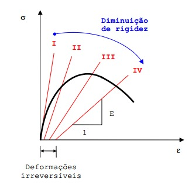

<!--Don't delete ths script-->

<!--Don't delete ths script-->

<head>
    <meta charset="UTF-8">
    <meta name="viewport" content="width=device-width, initial-scale=1.0">
    
</head>

<h1>Modelos não lineares</h1>

Ao contrário do tópico anterior imaginemos agora que as equações que formam o nosso sistema não têm características lineares, ou seja, as variáveis que formam estas equações não são de grau 1. 
  
Tais equações tem grandes aplicações no campo das ciências exatas e tecnológicas. Por exemplo a modelagem do comportamento do concreto é um exemplo característico de uma resposta não linear.

<table>
    <tbody>
        <tr>
            <td>\(
                \begin{cases}
                f_1(x_1, x_2, ..., x_{n-1}, x_n = 0 \\
                f_1(x_1, x_2, ..., x_{n-1}, x_n = 0 \\
                ... \\
                f_n(x_1, x_2, ..., x_{n-1}, x_n = 0
                \end{cases}
                \)
            </td>
            <td class="tag">(1)</td>
        </tr>
    </tbody>
</table>

<b>Figura 1.</b> Comportamento não linear do concreto [1].

    

<h1>Relembrando o método de Newton-Raphson para uma equação</h1>

O <b>método de Newton-Raphson</b> (ou Método de Newton) é um modelo de método computacional <b>baseado em informações da derivada da função</b> à qual deseja-se determinar a solução.
  
Primeiro precisamos discutir a importância de empregar informações da derivada, logo falaremos a sua interpretação geométrica.
  
A <b>primeira derivada</b> pode ser interpretada como <b>uma medida de coeficiente de variação angular de uma reta tangente</b> que passa por um determinado <b>ponto \(P\)</b> de uma <b>função \(f\)</b>. Para que se tenha validade a seguinte definição é necessário que <b>\(f\) seja contínua em \(P\)</b>.
  
Para que <b>\(f\) seja contínua em \(P\)</b> devem ser válidas as seguintes afirmações:

* Existe \(f(a)\);

* Existe \(f(x)\);

* \(f(x) = f(a)\).

Imaginemos que uma <b>função \(f(x)\)</b> pode ser <b>escrita como uma série de Taylor</b> no ponto \(x_1\), ou seja, possui o seguinte formato da equação (2):

<table>
    <tbody>
        <tr>
            <td>\(f(x) = \sum_{n_0}^\infty a_n \cdot (x - a)^n\)</td>
            <td class="tag">(2)</td>
        </tr>
        <tr>
            <td>\(a_n = f^(n) \frac{(a)}{n!}\)</td>
            <td class="tag">(3)</td>
        </tr>
    </tbody>
</table>

Portanto, se <b>\(f(x)\)</b> no ponto x1 pode ser escrito no formato de uma <b>série polinomial de Taylor conforme equação (4)</b>. Neste caso a série foi expandida até o termo de ordem 2:

<table>
    <tbody>
        <tr>
            <td>\(f(x) \approx f(x_1) + f'(x_1) \cdot \frac{(x - x_1)^1}{1!} + f''(a) \cdot \frac{(x - x_1)^2}{2!}\)</td>
            <td class="tag">(4)</td>
        </tr>
    </tbody>
</table>

Admitindo que o termo de <b>f'' é muito pequeno e que a f(x) possui dentro de um intervalo \([x_1,  x_2]\) uma raiz</b>, ou seja, <b>\(f(x)=0\)</b>. Logo podemos reescrever a equação (4):

<table>
    <tbody>
        <tr>
            <td>\(0 \approx f(x_1) + f'(x_1) \cdot (x - x_1)\)</td>
            <td class="tag">(5)</td>
        </tr>
        <tr>
            <td>\(\frac{-f(x_1)}{f'(x_1)} \approx x - x_1\)</td>
            <td class="tag">(6)</td>
        </tr>
        <tr>
            <td>\(x \approx x_1 - \frac{f(x_1)}{f'(x_1)}\)</td>
            <td class="tag">(7)</td>
        </tr>
    </tbody>
</table>