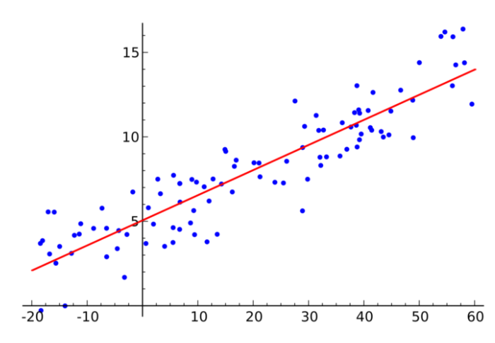
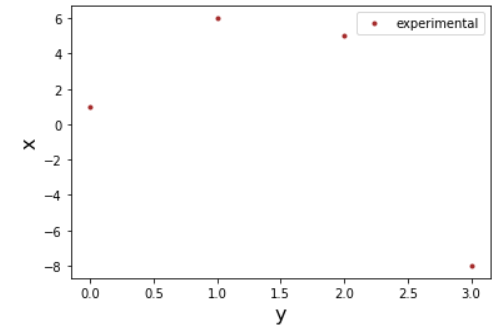
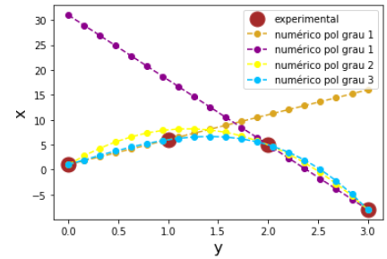

<!--Don't delete ths script-->

<!--Don't delete ths script-->

<head>
    <meta charset="UTF-8">
    <meta name="viewport" content="width=device-width, initial-scale=1.0">
    
</head>

<h1>Ajuste de curvas</h1>

O ajuste de curvas faz parte de uma teoria chamada de <b>teoria de aproximação de funções</b>. Onde deseja-se conhecer uma função similar a um determinado comportamento. 
  
Essa teoria é amplamente empregada em diversos campos da ciência como por exemplo a área de <b>aprendizado de máquina especificamente nos problemas de predição</b>. Por exemplo a Figura 1 apresenta uma regressão linear que representa um determinado padrão em um conjunto de dados.
  
Um problema de ajuste normalmente tenta <b>reduzir a distância entre a resposta da função aproximada e os dados observados</b>. 

<b>Figura 1. </b>Modelo de IA do tipo regressão linear para predição [1].

    

Logo neste contexto são exemplos de métodos para fazer essa aproximação em relação a uma observação:

<ul>
    <li>Método dos mínimos quadrados;</li>
    <li>Métodos de interpolação polinomial;</li>
    <li>Métodos de séries.</li>
</ul>

<h1>Interpolação polinomial</h1>

O problema de interpolação polinomial consiste na determinação de uma função polinomial que aproxima um conjunto de dados observados. Essa função pode ser escrita conforme equação (1):

<table>
    <tbody>
        <tr>
            <td>\(
                f_{(x)} = \sum_{k=0}^n a_n \cdot x^n
                \)
            </td>
            <td class="tag">(1)</td>
        </tr>
    </tbody>
</table>

Na interpolação será necessário escrever um <b>sistema de equações</b> para cada ponto \(x_i\). Portanto utilizaremos a <b>matriz de Vandermonde</b> para obter essa construção do sistema. A matriz de Vandermonde é apresentada na equação (2).

<table>
    <tbody>
        <tr>
            <td>\(
                \begin{bmatrix} 
                1 & x_0 & ... & x_0^n \\
                1 & x_1 & ... & x_1^n \\
                1 & x_2 & ... & x_2^n \\
                1 & x_3 & ... & x_3^n \\
                \end{bmatrix}
                \)
            </td>
            <td class="tag">(2)</td>
        </tr>
    </tbody>
</table>

No Python é possível obter a matriz de Vandermonde automaticamente. Vejamos que a matriz é montada a partir dos termos das abscissas, ou seja, o termo \(x\). A função é da biblioteca numpy e tem a seguinte sintaxe: \(numpy.vander(x, increasing = True)\).
  
Portanto para aplicar uma interpolação é necessário informar os pares ordenados para qual pretende-se aplicar a interpolação, ou seja, \(x_0\) necessita de um \(f_0\).
  
Observando a equação (1) é possível perceber que, por exemplo, 4 pontos geram um polinômio interpolador de terceiro grau do tipo:

<table>
    <tbody>
        <tr>
            <td>\(
                p(x) = a_0 + a_1 \cdot x + a_2 \cdot x^2 + a_3 \cdot x^3
                \)
            </td>
            <td class="tag">(3)</td>
        </tr>
    </tbody>
</table>

<b>Exemplo 1.1</b> [2,3]: Façam a montagem do sistema de Vandermonde para o seguintes problemas:

<table>
    <tbody>
        <tr>
            <td>{(0, 1), (1, 6), (2, 5), (3, -8)}</td>
            <td>a)</td>
        </tr>
        <tr>
            <td>{(0, 2.1), (1, 7.7), (2, 13.6), (3, 27.2), (4, 40.9), (5, 61.1)}</td>
            <td>b)</td>
        </tr>
    </tbody>
</table>

Como exemplo vamos resolver o problema a. A construção será feita utilizando a função da biblioteca Numpy. Como são 4 pontos o polinômio interpolador é de terceira ordem. Porém a matriz de Vandermonde é dada como:

<table>
    <tbody>
        <tr>
            <td>\(
                \begin{bmatrix} 
                1 & 0 & 0 & 0 \\
                1 & 1 & 1 & 1 \\
                1 & 2 & 4 & 8 \\
                1 & 3 & 9 & 27 \\
                \end{bmatrix}
                \)
            </td>
            <td class="tag">(4)</td>
        </tr>
    </tbody>
</table>

<h1>Qualidade do ajuste</h1>

A qualidade de um ajuste pode ser medida de diversas formas e basicamente todas elas consistem em uma comparação entre o valor numérico e o valor experimentalmente observado. Portanto será definida uma equação de resíduo. A qualidade do ajuste que iremos implementar é o \(R^2\). O \(R^2\) varia de 0% a 100% e representa a quantidade da variância que é explicada pelo modelo obtido.

<table>
    <tbody>
        <tr>
            <td>\(
                R^2 = 1 - \frac{\sum (y_i^{exp} - y_i^{num})^2}{\sum (y_i^{exp} - y_i^{num})^2}
                \)
            </td>
            <td class="tag">(5)</td>
        </tr>
    </tbody>
</table>

Onde \(y_i^{exp}\) indica o valor experimental, \(y_i^{num}\) o valor numérico e yinum é a média dos valores numéricos.
Vamos retomar o exemplo 1 para resolução do problema de interpolação polinomial. Para isso vamos começar visualizando o conjunto de dados.

<b>Figura 2. </b>Dados experimentais do exemplo 1a.

    

De posse da visualização dos dados experimentais podem montar o sistema completo relativo ao problema de ajuste de curva. Com isso será possível montar o vetor de incógnitas \(a\).

$$
\begin{bmatrix}
    1 & 0 & 0 & 0 \\
    1 & 1 & 1 & 1 \\
    1 & 2 & 4 & 8 \\
    1 & 3 & 9 & 27 \\
\end{bmatrix} 

\cdot 

\begin{bmatrix}
    a_0 \\
    a_1 \\
    a_2 \\
    a_3
\end{bmatrix}

= 

\begin{bmatrix}
    1 \\
    6 \\
    5 \\
    -8
\end{bmatrix}
$$

Aplicando os métodos de solução de sistemas é possível então determinar os coeficientes:

$$
\begin{bmatrix}
    a_0 \\
    a_1 \\
    a_2 \\
    a_3
\end{bmatrix}

= 

\begin{bmatrix}
    1 \\
    6 \\
    0 \\
    -1
\end{bmatrix}
$$

Refazendo o exemplo para diversos polinômios interpoladores chegamos as seguintes representações gráficas:

<b>Figura 3. </b>Representação do polinômio interpolador de diversos graus.

    

<h1>Referências</h1>

<table>
    <thead>
        <tr>
            <th>Código</th>
            <th>Referência</th>
        </tr>
    </thead>
    <tbody>
        <tr>
            <td>
[1]
</td>
            <td>
Esposito P. Modelos de Predição | Regressão Linear. Turing Talks 2020. https://medium.com/turing-talks/turing-talks-11-modelo-de-predi%C3%A7%C3%A3o-regress%C3%A3o-linear-7842709a593b (accessed October 6, 2021).
</td>
        </tr>
        <tr>
            <td>
[2]
</td>
            <td>
Justo DAR, Sauter E, Azevedo FS, Lima HGG, Guidi LF, Konzen PH de A. Interpolação polinomial. REAMAT-Cálculo Numérico, Porto Alegre: 2020.
</td>
        </tr>
        <tr>
            <td>
[3]
</td>
            <td>
Chapra SC. Métodos Numéricos Aplicados com MATLAB® para Engenheiros e Cientistas. 3a edição. AMGH; 2013.
</td>
        </tr>
    </tbody>
</table>