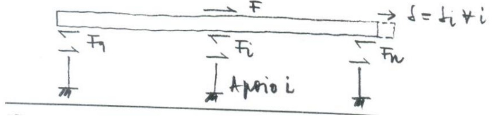
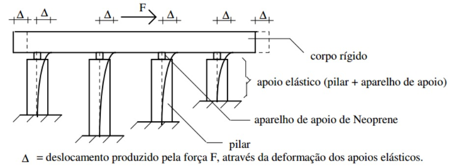
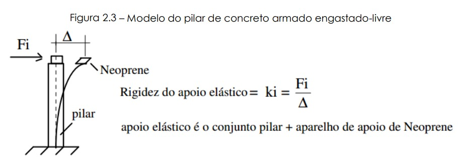
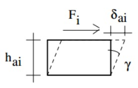
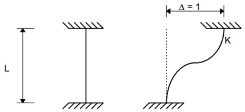
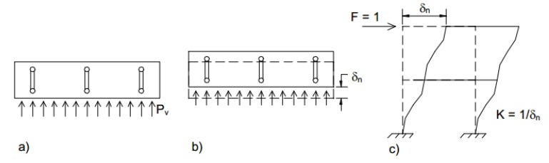
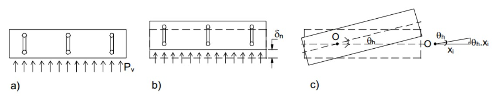
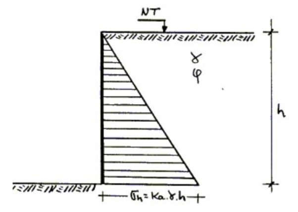
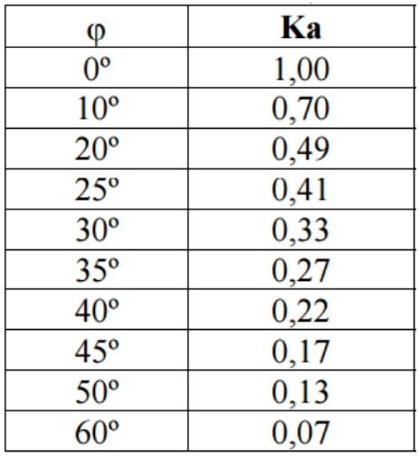

<!--Don't delete ths script-->

<!--Don't delete ths script-->

<head>
    <meta charset="UTF-8">
    <meta name="viewport" content="width=device-width, initial-scale=1.0">
    
</head>

<h1>Dimensionamento da mesoestrutura</h1>

<h2>Sumário</h2>
<ul>
    <li><a href="#secao1">1. Solicitações para o sistema de viga contínua</a></li>
    <li><a href="#secao2">2. Determinação das solicitações nos pilares</a></li>
    <li><a href="#secao3">3. Cálculo dos esforços longitudinais e transversais</a></li>
</ul>

<h2 id="secao1">Solicitações para o sistema de viga contínua</h2>

<h3>Esforços horizontais</h3>

Como o sistema é monolítico os deslocamentos sofridos pelo tabuleiro serão repassados ao topo de cada pilar de concreto da mesoestrutura. Segundo Taguti (2002) os seguintes esforços atuam transversalmente ao pilares:

<ol type="a">
    <li>Esforços longitudinais atuantes no tabuleiro
        <ul>
            <li>Frenagem e aceleração de veículos</li>
            <li>Empuxo de terra e sobrecarga na cortina</li>
            <li>Componente longitudinal do vento, calculadas da seguinte forma:
                <ul style="list-style-type: none;">
                    <li>• vento na superestrutura = 25% do esforço de vento na direção transversal</li>
                    <li>• vento no veículo = 40%</li>
                </ul>
            </li>
        </ul>
    </li>
    <li>Esforços transversais atuantes no tabuleiro
        <ul>
            <li>Vento</li>
            <li>Força centrífuga (pontes em curva horizontal)</li>
            <li>Impacto lateral (pontes ferroviárias)</li>
            <li>Empuxo de terra nas cortinas (pontes esconsas)</li>
        </ul>
    </li>
    <li>Esforços devidos a deformações impostas
        <ul>
            <li>Efeito da temperatura nas vigas principais</li>
            <li>Efeito da retração nas vigas principais</li>
        </ul>
    </li>
    <li>Esforços que atuam diretamente sobre os pilares
        <ul>
            <li>Empuxo de terra</li>
            <li>Pressão do vento</li>
            <li>Pressão d'água</li>
        </ul>
    </li>
</ol>

<h2 id="secao2">Determinação das solicitações nos pilares</h2>

<h3>Solicitação para sistema em viga contínua</h3>

De acordo com Araújo (2010) o sistema formado por vigas contínuas, quando a superestrutura sofre um deslocamento horizontal o topo dos pilares sofre o mesmo deslocamento por estes estarem ligados à superestrutura. O esforço
aplicado ao topo de cada pilar é igual ao produto do deslocamento pela rigidez do pilar (K). Portando faz-se a equação:

$$
F_i = k_i \cdot d_i = F \frac{K_i}{\sum K_j}
$$

<b>Figura 1.</b> Distribuição das cargas variáveis sobre o tabuleiro da ponte.

<b>(FONTE: Stucchi, 2006)</b>

<h3>Rigidez de pilares engastado-livre</h3>

Utilizando-se o modelo para as cargas horizontais, onde os pilares e seus respectivos aparelhos de apoio são considerados apoios elásticos, resulta que a superestrutura submetida a um esforço horizontal longitudinal F , sofre um
deslocamento D e, consequentemente, todos os topos dos pilares também se deslocarão de D (Fig. 2) . Com isso, a solução do problema se torna simples, bastando para tanto o cálculo das rigezas dos apoios elásticos (formado pelo conjunto: pilar e aparelho de apoio).

<b>Figura 2.</b> Modelo de cálculo da distribuição de forças longitudinais entre os apoios elásticos.

<b>(FONTE: Taguti, 2012)</b>

Verificando o sistema pilar apoio como uma barra engastada livre (Fig. 3) têm-se então o valor da rigidez de cada pilar: 

<b>Figura 3.</b> Modelo do pilar de concreto armado engastado-livre

<b>(FONTE: Taguti, 2012)</b>

  

<table>
    <tbody>
        <tr>
            <td>\( K_{pi} = \frac{F_i}{\delta_{pi}} \) mas \( \delta_{pi} = \frac{F_i \cdot l_{pi}^3}{3 E_{pi} \cdot I_{pi}} \) ∴ \( K_{pi} = \frac{3E_{pi} \cdot I_{pi}}{l_{pi}^3} \) = rigidez do pilar</td>
        </tr>
        <tr>
            <td>
                
Onde:

                <ul>
                    <li>\( l_{pi} \) = comprimento do pilar i;</li>
                    <li>\( I_{pi} \) = momento de inércia do pilar i;</li>
                    <li>\( E_{pi} \) = módulo de elasticidade do pilar i.</li>
                </ul>
            </td>
        </tr>
    </tbody>
</table>

Considerando agora a rigidez do aparelho de apoio têm-se então: 

<b>Figura 4.</b> Modelo do apoio em neoprene

<b>(FONTE: Taguti, 2012)</b>

  

<table>
    <tbody>
        <tr>
            <td>\(K_{ai} = \frac{F_I}{\delta_{ai}}\) mas, pela lei de Hooke, \( \gamma = \frac{\tau}{G_{ai}} \) e \( \tau = \frac{F_i}{A_{ai}} \) ∴ \( \gamma = \frac{F_i}{G_{ai} \cdot A_{ai}} \)</td>
        </tr>
        <tr>
            <td>tem-se: \( \gamma h_{ai} = \delta_{ai} \) ∴ \( \delta_{ai} = \frac{F_i \cdot h_{hi}}{G_{ai} \cdot A_{ai}} \)</td>
        </tr>
        <tr>
            <td>Portanto, \( K_{ai} = \frac{G_{ai} \cdot A_{ai}}{h_{ai}} \) = rigidez do aparelho de apoio.</td>
        </tr>
    </tbody>
</table>

Considerando agora a rigidez do conjunto completo tem-se o comportamento completo da ligação. A associação do pilar engastado-livre e o apoio em neoprene resultará em um elemento de rigidez Ki.

<b>Figura 5.</b> Modelo completo do apoio elástico

<b>(FONTE: Taguti, 2012)</b>

<table>
    <tbody>
        <tr>
            <td>\(\Delta = \delta_{ai} + \delta_{pi} = \frac{F_i}{K_{ai}} + \frac{F_i}{k_{pi}} = F_i (\frac{1}{K_{ai}} + \frac{1}{K_{pi}})\) definindo-se: \((\frac{1}{K_{i}} = \frac{1}{K_{ai}} + \frac{1}{K_{pi}})\)</td>
        </tr>
        <tr>
            <td>tem-se em cada conjnto pilar + aparelho de apoio, \(F_i = k_i \cdot \Delta\)</td>
        </tr>
        <tr>
            <td>onde, \(K_{i} = \frac{1}{\frac{1}{K_{ai}} + \frac{1}{K_{pi}}}\) = rigidez do apoio elástico (pilar + paralho de apoio) i.</td>
        </tr>
    </tbody>
</table>

<h3>Rigidez de pilares biengastado</h3>

Araújo (2010) cita a rigidez de pilares biengastados. Segundo o mesmo quando o pilar é biengastado, o procedimento é análogo, podendo a rigidez ser calculada como o inverso da flexibilidade (processo dos esforços) ou obtida diretamente de tabelas. Para o caso particular de pilar biengastado de inércia constante sua rigidez vale:

$$
K = \frac{12 E \cdot I}{L^3}
$$

  

<b>Figura 6.</b> Modelo do pilar biengastado

<b>(FONTE: Araújo, 2010)</b>

O cálculo da distribuição do esforço longitudinal entre os pilares é geralmente feito admitindo que o esforço horizontal seja aplicado no eixo de simetria do tabuleiro. No caso de pontes rodoviárias, por exemplo, admite-se que o
veículo tipo, ao freiar, esteja circulando no centro da pista de rolamento. Esta simplificação é admissível considerando que, em geral, a largura das pontes é muito menor que o seu comprimento (PFEIL, 1983).

<h3>Distribuição dos esforços transversais</h3>

Devido à grande rigidez que as lajes concedem, no plano horizontal, ao tabuleiro da ponte, este pode ser considerado, sob a ação de esforços transversais, como uma placa sobre apoios elásticos. Quando esses esforços incidem no tabuleiro, este se desloca horizontalmente solicitando os pilares. Se o deslocamento for apenas uma translação na direção horizontal, o problema é análogo ao de distribuição de esforços longitudinais, ou seja, cada eixo recebe um quinhão de carga proporcional à sua rigidez na direção transversal (Figura 7). Neste caso, a rigidez transversal de cada pilar (ou
eixo) deve ser calculada levando em conta a existência de vigas transversais ligando os pilares que formam, assim, pórticos nessa direção. Para tanto, a rigidez pode ser calculada como o inverso do deslocamento do topo do pórtico quando nesta posição é aplicada uma força unitária (ARAÚJO, 2010).

<b>Figura 7.</b> Vista em planta da atuação de esforços transversais no tabuleiro (a);
translação horizontal do tabuleiro (b); determinação da rigidez transversal do pórtico (c)

<b>(FONTE: Araújo, 2010)</b>

Quando ocorre a rotação do tabuleiro, cada pilar \(P_i\), distante \(x_i\) do ponto O, sofre um deslocamento horizontal \(θ_h x_i\), perpendicular ao eixo da ponte na posição original. Ao deslocamento do pilar corresponde um esforço \(K_i\), \(θ_h\), \(x_i\) na direção do deslocamento, sendo Ki a rigidez do pilar (ou eixo) na direção desse deslocamento (ARAUJO, 2010).

<table>
    <tbody>
        <tr>
            <td>\(F = F_{res} \cdot K_i (\frac{1}{\sum K} ± \frac{e \cdot x_i}{\sum K_i \cdot x_i^2})\)</td>
            <td>\(x_g = \frac{\sum K \cdot x}{\sum K}\)</td>
        </tr>
    </tbody>
</table>

<h2 id="secao3">Cálculo dos esforços longitudinais e transversais</h2>

<h3>Frenagem ou aceleração</h3>

Um veículo qualquer em movimento sobre uma ponte representa, em virtude de sua massa, uma certa força-viva de que é possuída. A força resultante é chamada frenagem. Do mesmo modo, ao iniciar seu movimento apoia-se sobre a estrutura transmitindo à mesma um esforço chamado aceleração.
  
O item 7.2.1.5 da NBR 7187 (ABNT, 2003) cita as orientações relativas a essa carga. No caso são os seguintes valores:
<ol type="a">
    <li>Pontes rodoviárias: sem impacto, aplicada na pavimentação:
        <ul>
            <li>Aceleração: 5% da carga móvel aplicada sobre o tabuleiro;</li>
            <li>Aceleração: 5% da carga móvel aplicada sobre o tabuleiro;</li>
        </ul>
</ol>

Deve-se adotar o valor mais desfavorável segundo Pfeil (1983).

<h3>Empuxo de terra</h3>

O item 7.1.4 da NBR 7187 (ABNT, 2003) apresenta as condições para o cálculo dos empuxos de terra atuantes sobre os pilares.
  
O empuxo de terra nas estruturas é determinado de acordo com os princípios da mecânica dos solos, em função de sua natureza (ativo, passivo ou de repouso), das características do terreno, assim como das inclinações dos taludes e dos paramentos. Como simplificação, pode ser suposto que o solo não tenha coesão e que não haja atrito entre o terreno e a estrutura, desde que as solicitações assim determinadas estejam a favor da segurança.
  
O peso específico do solo úmido deve ser considerado no mínimo igual a 18 kN/m³ e o ângulo de atrito interno no máximo igual a 30º. Os empuxos ativo e de repouso devem ser considerados nas situações mais desfavoráveis. A atuação do empuxo passivo só pode ser levada em conta quando sua ocorrência puder ser garantida ao longo de toda a vida útil da obra.
  
Quando a superestrutura funciona como arrimo dos aterros de acesso, a ação do empuxo de terra proveniente desses aterros pode ser considerada simultaneamente em ambas as extremidades somente no caso em que não haja juntas intermediárias do tabuleiro e desde que seja feita a verificação também para a hipótese de existir a ação em apenas uma das extremidades, agindo isoladamente (sem outras forças horizontais) e para o caso de estrutura em construção.
  
Nos casos de tabuleiro em curva ou esconso, deve ser considerada a atuação simultânea dos empuxos em ambas as extremidades, quando for mais desfavorável.
  
No caso de pilares implantados em taludes de aterro, deve ser adotada, para o cálculo do empuxo de terra, uma largura fictícia igual a três vezes a largura do pilar, devendo este valor ficar limitado à largura da plataforma do aterro.

<b>Figura 8.</b> Distribuição das cargas variáveis sobre o tabuleiro da ponte

<b>(FONTE: Maragon, 20--)</b>

  

<table>
    <tbody>
        <tr>
            <td>\(\sigma_v = \gamma \cdot h\)</td>
        </tr>
        <tr>
            <td>\(\sigma_h = K_a \cdot \gamm \cdot h\)</td>
        </tr>
        <tr>
            <td>Onde: \(K_a =\) coefiente de empuxo ativo</td>
        </tr>
        <tr>
            <td>\(K_a = \frac{1}{N_{\varphi}} = \frac{1}{tg^2 \cdot (45° + \frac{\varphi}{2})} = tg^2 (45° - \frac{\varphi}{2})\)</td>
        </tr>
        <tr>
            <td>\(\varphi =\) ângulo de atrito interno.</td>
        </tr>
    </tbody>
</table>

<h3>Deformações internas no estrado</h3>

Sob a ação da retração do concreto, o tabuleiro se encurta. Sob ação da temperatura, o tabuleiro se alonga ou se encurta, conforme a temperatura cresça ou decresça. Dada a sua ligação com o tabuleiro, os pilares são obrigados a acompanhar esse movimentos, resultando esforços aplicados nos topos dos pilares (ARAÚJO, 2010).
  
O efeito da retração pode ser assimilado a uma variação de temperatura de -15C. Quando todos os pilares sobre os quais o estrado se apoia são elásticos, os movimentos de alongamento e encurtamento ocorrem nos dois sentidos da direção longitudinal do tabuleiro e há, evidentemente, um plano perpendicular a essa direção no qual não ocorrem deslocamentos. Esse plano fica localizado no “centro de gravidade” das rigezas longitudinais, o qual é determinado de forma análoga ao “centro de gravidade” das rigezas transversais (ARAÚJO, 2010).
  
Conhecida a distância \(x\) de cada pilar ao ponto indeslocável, o deslocamento de seu topo é dado pela expressão \(α_c \cdot ΔT \cdot x\), no qual ac é o coeficiente de dilatação térmica do concreto armado (\(10^{-5/C}\)) e \(\Delta T\) é a variação de temperatura. O esforço aplicado no topo de cada pilar, devido à retração e à variação de temperatura, é dado por (ARAÚJO, 2010):

<table>
    <tbody>
        <tr>
            <td>\(F = K \cdot \alpha_c \cdot \Delta T \cdot \overline{x}\), onde \(K\) é a rigidez longitudinal do pilar</td>
        </tr>
        <tr>
            <td>Sob a ação da variação de temperatura, o tabuleiro pode alongar-se ou encurtar- se, mas a retração causa sempre encurtamento do tabuleiro. Frequentemente, afim de evitar assimetria de armação nos pilares, considera-se uma variação de ±25 °C nos cálculos das solicitações, sendo que 15 °C correspondem àretração e 10 °C àvariação de temperatura.</td>
        </tr>
    </tbody>
</table>

Sob a ação da variação de temperatura, o tabuleiro pode alongar-se ou encurtar- se, mas a retração causa sempre encurtamento do tabuleiro. Frequentemente, afim de evitar assimetria de armação nos pilares, considera-se uma variação de ±25 °C nos cálculos das solicitações, sendo que 15 °C correspondem àretração e 10 °C àvariação de temperatura.