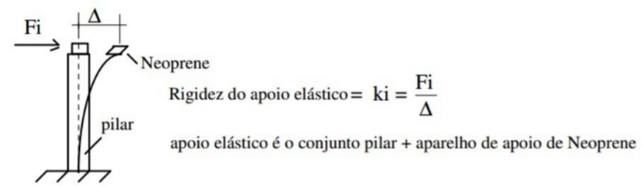
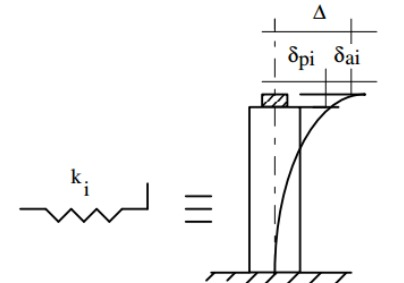

<!--Don't delete ths script-->

<!--Don't delete ths script-->

<head>
    <meta charset="UTF-8">
    <meta name="viewport" content="width=device-width, initial-scale=1.0">
    
</head>

<h1>Dimensionamento da mesoestrutura</h1>

<h2>Sumário</h2>
<ul>
    <li><a href="#secao1">1. Solicitações para o sistema de viga contínua</a></li>
    <li><a href="#secao2">2. Determinação das solicitações nos pilares</a></li>
    <li><a href="#secao3">3. Cálculo dos esforços longitudinais e transversais</a></li>
</ul>

<h2 id="secao1">Solicitações para o sistema de viga contínua</h2>

<h3>Esforços horizontais</h3>

Como o sistema é monolítico os deslocamentos sofridos pelo tabuleiro serão repassados ao topo de cada pilar de concreto da mesoestrutura. Segundo Taguti (2002) os seguintes esforços atuam transversalmente ao pilares:

<ol type="a">
    <li>Esforços longitudinais atuantes no tabuleiro
        <ul>
            <li>Frenagem e aceleração de veículos</li>
            <li>Empuxo de terra e sobrecarga na cortina</li>
            <li>Componente longitudinal do vento, calculadas da seguinte forma:
                <ul style="list-style-type: none;">
                    <li>• vento na superestrutura = 25% do esforço de vento na direção transversal</li>
                    <li>• vento no veículo = 40%</li>
                </ul>
            </li>
        </ul>
    </li>
    <li>Esforços transversais atuantes no tabuleiro
        <ul>
            <li>Vento</li>
            <li>Força centrífuga (pontes em curva horizontal)</li>
            <li>Impacto lateral (pontes ferroviárias)</li>
            <li>Empuxo de terra nas cortinas (pontes esconsas)</li>
        </ul>
    </li>
    <li>Esforços devidos a deformações impostas
        <ul>
            <li>Efeito da temperatura nas vigas principais</li>
            <li>Efeito da retração nas vigas principais</li>
        </ul>
    </li>
    <li>Esforços que atuam diretamente sobre os pilares
        <ul>
            <li>Empuxo de terra</li>
            <li>Pressão do vento</li>
            <li>Pressão d'água</li>
        </ul>
    </li>
</ol>

<h2 id="secao2">Determinação das solicitações nos pilares</h2>

<h3>Solicitação para sistema em viga contínua</h3>

De acordo com Araújo (2010) o sistema formado por vigas contínuas, quando a superestrutura sofre um deslocamento horizontal o topo dos pilares sofre o mesmo deslocamento por estes estarem ligados à superestrutura. O esforço
aplicado ao topo de cada pilar é igual ao produto do deslocamento pela rigidez do pilar (K). Portando faz-se a equação:

$$
F_i = k_i \cdot d_i = F \frac{K_i}{\sum K_j}
$$

<b>Figura 1.</b> Distribuição das cargas variáveis sobre o tabuleiro da ponte.

<b>(FONTE: Stucchi, 2006)</b>

<h3>Rigidez de pilares engastado-livre</h3>

Utilizando-se o modelo para as cargas horizontais, onde os pilares e seus respectivos aparelhos de apoio são considerados apoios elásticos, resulta que a superestrutura submetida a um esforço horizontal longitudinal F , sofre um
deslocamento D e, consequentemente, todos os topos dos pilares também se deslocarão de D (Fig. 2) . Com isso, a solução do problema se torna simples, bastando para tanto o cálculo das rigezas dos apoios elásticos (formado pelo conjunto: pilar e aparelho de apoio).

<b>Figura 2.</b> Modelo de cálculo da distribuição de forças longitudinais entre os apoios elásticos.

<b>(FONTE: Taguti, 2012)</b>

Verificando o sistema pilar apoio como uma barra engastada livre (Fig. 3) têm-se então o valor da rigidez de cada pilar: 

<b>Figura 3.</b> Modelo do pilar de concreto armado engastado-livre

<b>(FONTE: Taguti, 2012)</b>

  

<table>
    <tbody>
        <tr>
            <td>\( K_{pi} = \frac{F_i}{\delta_{pi}} \) mas \( \delta_{pi} = \frac{F_i \cdot l_{pi}^3}{3 E_{pi} \cdot I_{pi}} \) ∴ \( K_{pi} = \frac{3E_{pi} \cdot I_{pi}}{l_{pi}^3} \) = rigidez do pilar</td>
        </tr>
        <tr>
            <td>
                
Onde:

                <ul>
                    <li>\( l_{pi} \) = comprimento do pilar i;</li>
                    <li>\( I_{pi} \) = momento de inércia do pilar i;</li>
                    <li>\( E_{pi} \) = módulo de elasticidade do pilar i.</li>
                </ul>
            </td>
        </tr>
    </tbody>
</table>

Considerando agora a rigidez do aparelho de apoio têm-se então: 

<b>Figura 4.</b> Modelo do apoio em neoprene

<b>(FONTE: Taguti, 2012)</b>

  

<table>
    <tbody>
        <tr>
            <td>\(K_{ai} = \frac{F_I}{\delta_{ai}}\) mas, pela lei de Hooke, \( \gamma = \frac{\tau}{G_{ai}} \) e \( \tau = \frac{F_i}{A_{ai}} \) ∴ \( \gamma = \frac{F_i}{G_{ai} \cdot A_{ai}} \)</td>
        </tr>
        <tr>
            <td>tem-se: \( \gamma h_{ai} = \delta_{ai} \) ∴ \( \delta_{ai} = \frac{F_i \cdot h_{hi}}{G_{ai} \cdot A_{ai}} \)</td>
        </tr>
        <tr>
            <td>Portanto, \( K_{ai} = \frac{G_{ai} \cdot A_{ai}}{h_{ai}} \) = rigidez do aparelho de apoio.</td>
        </tr>
    </tbody>
</table>

Considerando agora a rigidez do conjunto completo tem-se o comportamento completo da ligação. A associação do pilar engastado-livre e o apoio em neoprene resultará em um elemento de rigidez Ki.

<b>Figura 5.</b> – Modelo completo do apoio elástico

<b>(FONTE: Taguti, 2012)</b>

<table>
    <tbody>
        <tr>
            <td>\(\Delta = \delta_{ai} + \delta_{pi} = \frac{F_i}{K_{ai}} + \frac{F_i}{k_{pi}} = F_i (\frac{1}{K_{ai}} + \frac{1}{K_{pi}})\) definindo-se: \((\frac{1}{K_{i}} = \frac{1}{K_{ai}} + \frac{1}{K_{pi}})\)</td>
        </tr>
        <tr>
            <td>tem-se em cada conjnto pilar + aparelho de apoio, \(F_i = k_i \cdot \Delta\)</td>
        </tr>
        <tr>
            <td>onde, \(K_{i} = \frac{1}{\frac{1}{K_{ai}} + \frac{1}{K_{pi}}}\) = rigidez do apoio elástico (pilar + paralho de apoio) i.</td>
        </tr>
    </tbody>
</table>

<h3>Rigidez de pilares biengastado</h3>

Araújo (2010) cita a rigidez de pilares biengastados. Segundo o mesmo quando o pilar é biengastado, o procedimento é análogo, podendo a rigidez ser calculada como o inverso da flexibilidade (processo dos esforços) ou obtida diretamente de tabelas. Para o caso particular de pilar biengastado de inércia constante sua rigidez vale:

