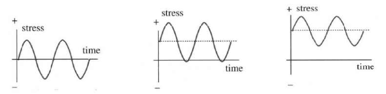
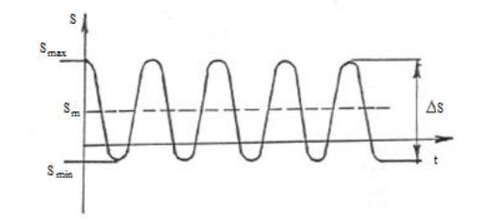
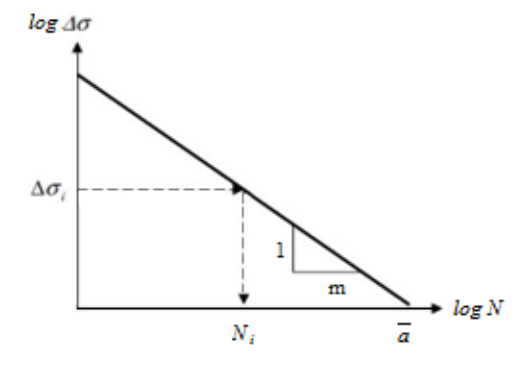
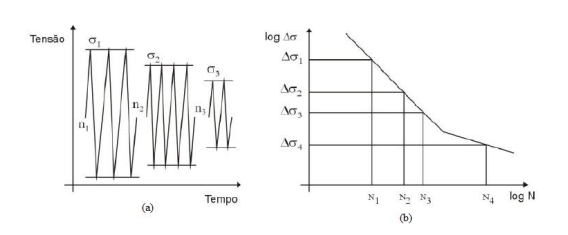
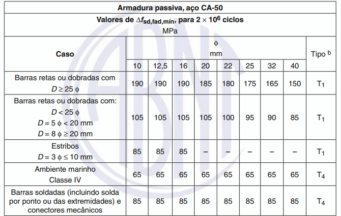
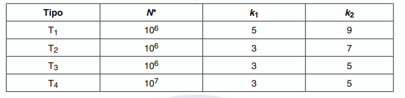

<!--Don't delete ths script-->

<!--Don't delete ths script-->

<head>
    <meta charset="UTF-8">
    <meta name="viewport" content="width=device-width, initial-scale=1.0">
    
</head>

<h1>Fadiga no material</h1>

<h2>Sumário</h2>
<ul>
    <li><a href="#secao1">1. Conceitos gerais de fadiga</a></li>
    <li><a href="#secao2">2. Fadiga em pontes</a></li>
</ul>

<h2 id="secao1">Conceitos gerais de fadiga</h2>

<h3>Fenômeno da fadiga</h3>

A fadiga pode ser definida como a alteração mecânica dos materiais sob o efeito de solicitações repetidas. As ações que causam fadiga são aquelas que produzem variações de solicitações com frequência relativamente alta. Dentre elas podem ser citadas: cargas móveis, ondas do mar, sismos, vento, variações de temperatura, congelamentos, etc. Normalmente, os maiores problemas de fadiga ocorrem para situações com elevado número de ciclos, de \(10^3\) a \(10^8\).
  
Callister (1991) afirma que sob estas circunstâncias é possível para a falha ocorrer num nível de tensão consideravelmente inferior ao limite de resistência à tração ou ao limite de escoamento para uma carga estática.
  
Falhas de fadiga é do tipo frágil em natureza mesmo em metais normalmente dúcteis, no sentido de que existe muito pouca, se é que exista alguma, deformação plástica bruta associada com a falha. O processo ocorre pela iniciação e propagação de trincas e ordinariamente a superfície de fratura é perpendicular à direção de uma tensão de tração aplicada (CALLISTER, 1991).
  
Falhas de fadiga é do tipo frágil em natureza mesmo em metais normalmente dúcteis, no sentido de que existe muito pouca, se é que exista alguma, deformação plástica bruta associada com a falha. O processo ocorre pela iniciação e propagação de trincas e ordinariamente a superfície de fratura é perpendicular à direção de uma tensão de tração aplicada (RIBEIRO DANTAS, 2010).
  
A flutuação do campo de tensões pode ser dado de três maneiras e os mesmos podem ser exemplificados logo abaixo.

<b>Figura 1.</b> Tipos de ciclos de tensão.

<b>(FONTE: DNIT, 1996)</b>

Ribeiro Dantas (2010) cita que o processo da fadiga é composto por 3 estágios que tem como consequência o enfraquecimento progressivo das estruturas, são eles:

<ol type="a">
    <li>Etapa 1:
        <ul>
            <li>Em um ponto de concentração de tensão, acontece a nucleação da fissura a um nível microscópico, pré-existência de microfissuras devido a falhas previamente ao processo de fadiga.</li>
        </ul>
    </li>
    <li>Etapa 2: 
        <ul>
            <li>Esta etapa se caracteriza pelo crescimento estável da fissura em plano perpendicular ao plano da tensão principal de tração (propagação da fissura), a cada ciclo de tensões a um aumento do tamanho da falha e uma diminuição da rigidez do elemento estrutural. A fratura neste estágio já atingiu o nível macroscópico, isto é, pode ser vista a olho nu.</li>
        </ul>
    </li>
    <li>Etapa 3
        <ul>
            <li>Ruptura final, que ocorre de forma repentina, uma vez que a fissura que está avançando atingiu sua abertura crítica necessária para a propagação instável.</li>
            <li>Efeito da retração nas vigas principais</li>
        </ul>
    </li>
</ol>

<h3> Resistência a fadiga do concreto e das barras de aço</h3>

Segundo Ribeiro Dantas (2010):

<table>
    <tbody>
        <tr>
            <td>A resistência do concreto à fadiga é estimada como uma porcentagem sobre a resistência estática suportada por um número \(N\) de ciclos (ACI 215R 1991). Fatores como a amplitude de tensões, tensão máxima, características do concreto e o tipo de carregamento são capazes de influenciar essa resistência.</td>
        </tr>
        <tr>
            <td>O tempo de vida à fadiga do concreto está associado à amplitude de tensões a que o material está sujeito. Quanto maior a variação de tensão menor será a quantidade de ciclos que a estrutura poderá suportar. Além disso, a resistência também é influenciada pelo tipo de solicitação da estrutura (compressão, tração, cisalhamento).</td>
        </tr>
        <tr>
            <td>Para a resistência à fadiga das barras de aço para concreto armado, fatores como diâmetro, raio de curvatura e classe de agressividade do ambiente são os que mais influenciam. Outros fatores como emendas, curvaturas, ancoragens e tipo de aço também podem interferir (CEB, 1987).</td>
        </tr>
    </tbody>
</table>

<h2 id="secao2">Fadiga em pontes</h2>

<h3>Avaliação da capacidade resistiva</h3>

Como as pontes são formadas por aço e concreto o efeito de fadiga está totalmente relacionado com a avaliação da capacidade resistiva da peça.
  
A fadiga é abordado pela NBR 6118 (ABNT, 2014) no item 23. Algumas informações são propostas nessa norma, são elas:

<ul>
    <li>Não são tratadas nesta Norma as ações de fadiga de alta intensidade, capazes de provocar danos com menos de 20.000 repetições.</li>
    <li>As ações de fadiga de média e baixa intensidade e número de repetições até 2.000.000 de ciclos são consideradas nas disposições estabelecidas nesta Seção. Para a consideração do espectro de ações, admite-se que podem ser excluídas aquelas de veículos com carga total até 30 kN, para o caso de pontes rodoviárias.</li>
    <li>Segundo Araújo (2010) a variação de tensões, em serviço, das barras da armadura longitudinal devem ficar limitadas a valores admissíveis a fim de prevenir a ruptura por fadiga.</li>
    <li>O critério admitido nessa norma é o critério de Palmgren-Miner, também chamado critério de dano acumulativo.</li>
</ul>

Esse modelo é baseado em curvas do tipo S-N, que representam uma relação entre a amplitude da flutuação de tensões (S) com o número de ciclos necessários (N) para gerar uma fissura na estrutura.

<b>Figura 2.</b> Variação cíclica de amplitude constante.

<b>(FONTE: Belisário, 2015)</b>

Em flutuações uniformes, um ciclo é descrito pelo intervalo de tempo entre dois picos consecutivos  de tensão.  As  curvas S-N fornecem  o número  máximo  N  de ciclos que o elemento estrutural  com um determinado detalhe geométrico ou solda  é capaz de suportar  sob  variação  constante  de  uma  determinada  amplitude  de  tensão  trativa, compressiva  ou  cisalhante,  de  um  mesmo  sinal  ou  inversão  de  sinal (GURNEY et al. 1974 apud Belizário 2015).

<b>Figura 3.</b> Curva S-N.

<b>(FONTE: Belisário, 2015)</b>

<table>
    <tbody>
        <tr>
            <td>\(N = C \cdot \Delta \sigma^{-m}\)</td>
        </tr>
        <tr>
            <td>\(N\) representa o número de cliclos para iniciação de fratura;</td>
        </tr>
        <tr>
            <td>\(C\) representa uma constate adimensional;</td>
        </tr>
        <tr>
            <td>\(\Delta \sigma\) representa a variação de tensão;</td>
        </tr>
        <tr>
            <td>\(m\) representa a inclinação negativa da curva;</td>
        </tr>
    </tbody>
</table>

Miner  considerou  que  o  fenômeno  dos  danos acumulados,  ou  seja,  a deterioração  da  resistência  é  proporcional  à  energia  absorvida  pelo  material.  O  dano associado  à  certa  amplitude  de  variação  de  tensão  \(\Delta \sigma \),  é  calculado  com  a  divisão  do número  de  ciclos  que  a  estrutura  recebe  pelo  número  de  ciclos  N  necessários  para  o inicio da fratura que leva à ruptura  da peça  sob a variação uniforme \(\Delta \sigma \)  (valor obtido pela curva S-N).  O limite da  ruptura ocorre quando o somatório  dos  danos  é igualada  a 1 (BELIZÁRIO, 2015).
  
Belizário (2015) apresenta um histórico de carregamento formatado em uma curva S-N conforme exposto na Fig. 4.

<b>Figura 4.</b> Regra de dano acumulad (a) histórico de carregamento reduzido; (b) número de ciclos para iniciação de fratura.

<b>(FONTE: adaptado Wei Lu 2013 apud, Belisário, 2015)</b>

Devido à aplicação deste carregamento, a vida útil à fadiga do material foi reduzida pelo acúmulo de danos \(\frac{n_i}{N_i}\). O dano total gerado \(N_i\) por \(k\) níveis de variação de tensão é dado por:

$$
D_i = \sum_{i=i}^n \frac{n_i}{N_i}
$$

O tempo de vida à  fadiga de uma estrutura pode ser obtido  pelo inverso do dano acumulado. A  regra  permite  determinar  a  fração  da  vida  útil  já  gasta pela  estrutura.  Esta  definição  pode  auxiliar  a  fazer  intervenções  nos  momentos adequados, podendo evitar possíveis falhas por fadiga (BELISÁRIO, 2015). Logo o \(T_{vu}\) (Tempo de vida útil) é dado por:

<table>
    <tbody>
        <tr>
            <td>\(T_{uv} = \frac{1}{D}\)</td>
        </tr>
        <tr>
            <td>\(T_{uv}\) representa o tempo de vida à fadiga na unidade de tempo correspondente à ação dos ciclos \(n_i\);</td>
        </tr>
        <tr>
            <td>\(D\) representa o dano total acumulado.</td>
        </tr>
    </tbody>
</table>

Para a NBR 6118 (ABNT, 2014) a flutuação da tensão limite deve ser menor que a tensão resistente a fadiga. Matematicamente e de forma simplificada essa formatação é dada pela equação abaixo. 

<table>
    <tbody>
        <tr>
            <td>\(\Delta \sigma_{max} < \Delta \sigma_{fat}\)</td>
        </tr>
        <tr>
            <td>\(\Delta \sigma_{max}\) representa a variação de tensão máxima;</td>
        </tr>
        <tr>
            <td>\(\Delta \sigma_{fat}\) representa a tensão limite de corte do material.</td>
        </tr>
    </tbody>
</table>

<h3>Cálculo da fadiga para armadura</h3>

No item 23.5.5 são feitas as ponderações sobre a verificação em fadiga nas armaduras. De acordo com a NBR 6118 (ABNT, 2014) essa verificação é  satisfeita  se  a  máxima  variação  de  tensão  calculada,  \(\Delta \sigma_{Ss}\),  para  a  combinação frequente de cargas satisfizer:

$$
\gamma_f \Delta \sigma_{Ss} \le \Delta f_{sd, fad}
$$

Onde os valores de \(\Delta f_{sd, fad}\) são dados na Tabela 1 (Ver Tabela 23.2) da norma. Já a Tabela 2 (Ver Tabela 23.3) apresenta os parâmetros da curva S-N.

<b>Tabela 1.</b> Parâmetros para as curvas S-N (Woeller) para os aços dentro do concreto.

<b>(FONTE: ABNT NBR 6118, 2014)</b>

<b>Tabela 2.</b>Tipos da curva S-N.

<b>(FONTE: ABNT NBR 6118, 2014)</b>

Para o cálculo de fadiga da armadura longitudinal considera-se o cálculo da tensão no Estádio II dada pela equação abaixo:

<table>
    <tbody>
        <tr>
            <td>\(\sigma_{x, max}^+ = \frac{\alpha_e \cdot |M_{s, max}| \cdot (d - x_II)}{I_{II}} \)</td>
            <td>Tensão na armadura tracionada</td>
        </tr>
        <tr>
            <td>\(\sigma_{x, max}^- = \frac{\alpha_e \cdot |M_{s, max}| \cdot (d' - x_II)}{I_{II} }\)</td>
            <td>Tensão na armadura comprimida</td>
        </tr>
    </tbody>
</table>

Aplicando a equação da norma para auxílio do cálculo do fator \(K\):

$$
\gamma_{fat} \cdot \Delta \sigma_{s,max}^{+ ou -} = \gamma_{fat} \cdot (\sigma_{s,max}^{+ ou -} - \sigma_{s,min}^{+ ou -})
$$

Logo pode-se calcular o valor de K. Que deve ser utilizado para multiplicar a armadura quando a flutuação de tensão for maior que o permitido.

$$
K = \frac{\gamma_{fat} \cdot \Delta \sigma_{s}^{+ ou -}}{\Delta_{fsd, faa}}
$$

Para o cálculo de fadiga da armadura transversal existem duas hipóteses ou modelos de cálculo para essa armadura. Modelo I ou II. Nesse material vai ser utilizado o cálculo pelo Modelo I de cisalhamento.
  
Além da observação do Modelo deve-se observar se há inversão do sinal do cisalhamento e então o cálculo é feito de duas formas:

<table>
    <tbody>
        <tr>
            <td>\(\Delta \sigma_w = \sigma_{sw, max} - 0 = \frac{|V_{g + q}|_{max} - 0.50 \cdot V_c}{0.90 \cdot d \cdot \frac{A_{sw}}{s}}\)</td>
            <td>Havendo inversão</td>
        </tr>
        <tr>
            <td>\(\Delta \sigma_w = \sigma_{sw, max} - \sigma_{sw, min} = \frac{|V_{g + q}|_{max} - 0.50 \cdot V_c}{0.90 \cdot d \cdot \frac{A_{sw}}{s}} \cdot \frac{|V_{g + q}|_{max} - |V_{g + q}|_{min}}{|V_{g + q}|_{max}}\)</td>
            <td>Não havendo inversão</td>
        </tr>
        <tr>
            <td>\(K_{sw} = \frac{\Delta \sigma_{sw}}{\Delta_{fsd, fad}}\)
    </tbody>
</table>

<h3>Cálculo da fadiga para o concreto</h3>

As observações sobre a fadiga no concreto estão descritas no item 23.5.4.1 da NBR 6118 (ABNT, 2014), conforme equação abaixo:

