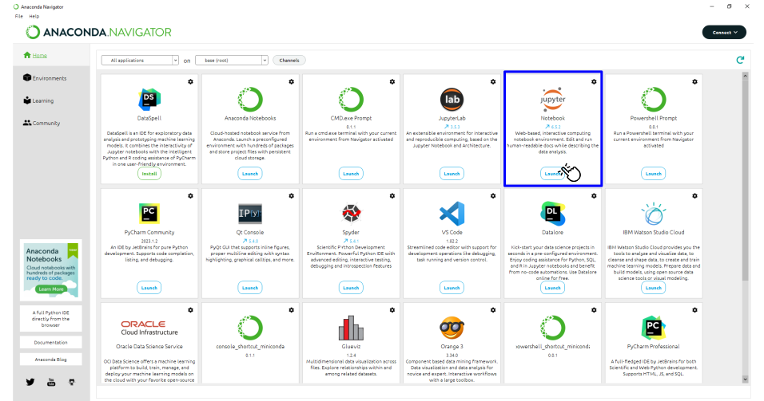

<h1>O que vamos ver?!</h1>

<p align = "justify">
Este é o curso de Métodos Computacionais parte 1 (<i>MCOMP0001</i>) e tem como objetivo central oferecer aos alunos uma introdução a programação em <b>Python</b> que será a linguagem empregada ao longo de todo o curso.<br><br>

Este curso é ministrado foi produzido pelo Grupo de Pesquisa e Estudos em Engenharia (GPEE) que é liderado pelo professor <a href="http://lattes.cnpq.br/2268506213083114" target = "_blank" rel = "noopener noreferrer">Wanderlei Malaquias Pereira Junior</a>.<br><br>

Nesta etapa que chamaremos esse curso pelo código <i>MCOMP1</i>. Este espaço será destinado a apresentação do seguinte conteúdo:
</p>

<table>
  <tr>
    <td style = "width:70%;">
        <ol>
            <li>Introdução à lógica;</li>
            <li>Expressões e operadores;</li>
            <li>Estrutras de controle;</li>
            <li>Estrutras homogêneas;</li>
            <li>Estrutras especiais;</li>
            <li>Manipulação de arquivos;</li>
            <li>Paradigmas.</li>
        </ol>
    </td>
    <td style = "width:30%;"><center></center></td>
  </tr>
</table>

<h1>Instalação da linguagem e IDE</h1>

<p align = "justify">
Vamos iniciar o curso pela instalação da linguagem de programação e dos ambientes que que devem/podem ser utilizados ao longo do curso. A lista não é extensa porém vamos fazer uso destas ferramentas para facilitar o nosso desempenho no curso.
</p>

<ol>
    <li><a href="https://www.anaconda.com/download" target = "_blank" rel = "noopener noreferrer">Anaconda <i>Environment</i></a>;</li>
</ol>

<p align = "justify">
Antes disso vamos testar o ambiente <b>Anaconda Navigator</b>. Nas nossas aplicações vamos usar a IDE (<i>Integrated Development Environment</i>) notebook <b>Jupyter</b>. Esse ambiente é bastante prático pois fornece suporte para linguagem além de permitir anotações em formato de linguagem de marcação <b>Markdown</b>.<br><br>
A <a href = "#fig11">Figura 1.1</a> apresenta uma imagem da posição da IDE notebook <b>Jupyter</b> na plataforma <b>Anaconda Navigator</b>. 
</p>

<p align = "left" id = "fig11"><b>Figura 1.1</b> <i>Home</i> da plataforma <b>Anaconda Navigator</b>.</p>
<center></center>

<h2>Um pouco sobre o uso da IDE notebook Jupyter</h2>

<p align = "justify">
O notebook Jupyter é muito parecido com um caderno digital. Ele permite que você faça seus códigos e também gere comentários usando a linguagem de marcação Markdown. Você pode acessar o conteúdo de <a href="http://cursos.leg.ufpr.br/prr/capMarkdown.html" target = "_blank" rel = "noopener noreferrer">Mayer e Zeviani</a> <a href = "#ref1">[1]</a> para entender um pouco do funcionamento desta linguagem de marcação. 
</p>

<p align = "justify">
Ao abrir o ambiente notebook Jupyter podemos criar um novo notebook conforme indicação na <a href = "#fig12">Figura 1.2</a> e então poderemos utilizar a linguagem Python.
</p>

<p align = "left" id = "fig12"><b>Figura 1.2</b> Tela inicial da interface Jupyter.</p>
<center></center>

<p align = "justify">
A estrutura interna de um notebook é apresentada na <a href = "#fig13">Figura 1.3</a> e então poderemos utilizar a linguagem Python.
</p>

<p align = "left" id = "fig13"><b>Figura 1.3</b> Tela inicial de um notebook Jupyter.</p>
<center></center>

Na <a href = "#fig13">Figura 1.3</a> podemos observar o campo <code>In</code> onde poderá ser escrito um código Python ou um código de marcação para edição do texto. Para controlar o modelo de campo basta acessar o menu <b>Cell</b> e alterar o tipo de célula.

O menu <b>File</b> contém informações de abertura, salvamento e <i>download</i> de arquivos. É válientar que o notebook libera <i>download</i> de modelos como .pdf, .html e .py.

O menu <b>Kernel</b> é o pesçao destinado aos comandos de execução do código que em um notebook Jupyter permite a execução célula a célula.

<h1>Um pouco sobre a linguagem</h1>

<p align = "justify">
Pode-se dizer que o Python é uma liguagem meio compilada e meio interpretada. A parte da compilação fica escondida do programador. Não iremos abordar isso no curso mas para ficar mais claro linguagens interpretadas são aquelas em que o código fonte é lido linha por linha e executado diretamente pelo interpretador em tempo de execução. O interpretador traduz cada instrução ou bloco de instruções para código de máquina em tempo real e executa-o imediatamente.
</p>

<p align = "justify">
Além disso vale comentar que o Python é uma linguagem de tipagem dinâmica e forte. A tipagem dinâmica permite que você altere o tipo da variável em tempo de execução. O Python detectará automaticamente o tipo da variável e atribuirá o tipo. Vejamos um exemplo: 
</p>

```python
valor = 'wanderlei'
print('tipo :', type(valor))
valor = 12
print('tipo :', type(valor))
valor = 12.45
print('tipo :', type(valor))
```

```cmd
tipo : <class 'str'>
tipo : <class 'int'>
tipo : <class 'float'>
```

<p align = "justify">
Já a tipagem forte diz respeito ao padrão conversão para realizar operações. Por exemplo se em Python tentarmos somar um nome com um valor inteiro, essa soma não será possível sendo retornado um erro na interface. Vejamos um exemplo:
</p>

```python
nome = 'Wanderlei Junior'
idade = 33
print(nome + " " + idade)
```

```cmd
---------------------------------------------------------------------------
TypeError                                 Traceback (most recent call last)
Cell In[3], line 4
      1 nome = "Wanderlei Junior"
      2 idade = 33
----> 4 print(nome + " " + idade)

TypeError: can only concatenate str (not "int") to str
```

{: .note }
> Em outras linguagens como o JavaScript a linguagem faria a uma conversão implícita e a combinação `Wanderlei Junior 33` iria aparecer no console.

<h2>Função print e o <i>Hello World</i></h2>

<p align = "justify">
A função print é nativa da linguagem Python e permite que possamos apresentar em tela valores de algumas variáveis para o usuário. O comando é muito importante na ocnstrução de um código pois ele permitirá que o desenvolvedor cheque em parte o seu codigo e irá permitir que o usuário possa ver os resultados de um <i>software</i>.
<br><br>
Aqui vamos usar o conceito da função <code>print()</code> para escrever nosso primeiro algoritmo Python. A função <code>print()</code> tranforma tudo que está dentro do objeto principal em uma <i>string</i>.
<br><br>
Na <a href = "#fig14">Figura 1.4</a> o passo 1 é dado pela digitação do que desejamos imprimir na tela. Para isso colocamos a informação <i>hello world</i> dentro de aspas simples <code>'texto aqui'</code> ou aspas duplas <code>"texto aqui"</code>. No passo 2 fazemos a execução do algoritmo que resultada na <a href = "#fig15">Figura 1.5</a>
</p>

<p align = "left" id = "fig14"><b>Figura 1.4</b> Escrevendo o <i>hello world</i>.</p>
<center></center>

<p align = "left" id = "fig15"><b>Figura 1.5</b> <i>hello world</i> executado.</p>
<center></center>

<p align = "justify">
Na <a href = "#fig15">Figura 1.5</a> o passo 1 mostra o que foi impresso em tela e o passo 2 mostra que a célular <code>In[1]</code> foi executada.
</p>

{: .note }
> Lembre-se de que a função ```print()``` é muito flexível e pode ser usada de diversas maneiras para formatar a saída de acordo com suas necessidades.

<h2>A sintaxe do Python</h2>

<p align = "justify">
O Python utiliza a identação para delimitar blocos de código em vez de chaves, parênteses ou palavras-chave como em C, C++, Java e muitas outras linguagens. Isso significa que a consistência na indentação é crucial para o funcionamento do código Python. Por exemplo, um bloco condicional <code>if</code> é definido pela indentação adequada e não por chaves:
</p>

```python
if x > 5:
    print("x é maior que 5")
```
<p align = "justify">
Em Java a mesma função seria marcada pelo uso de chaves.
</p>

```java
if (x > 5) {
    System.out.println("x é maior que 5");
}
```

<p align = "justify">
O Python não requer ponto e vírgula (;) no final de cada sentença como muitas outras linguagens. A nova linha é usada para indicar o fim de uma sentença.
</p>

<p align = "justify">
O Python usa o símbolo <code>#</code> para comentários de linha única e aspas triplas <code>'''</code> ou <code>"""</code> para comentários de várias linhas.
</p>

```python
# Isso é um comentário de linha única

"""
Isso é um comentário de
múltiplas linhas
"""
```

<h1>Referências</h1>

<table>
    <thead>
        <tr>
            <th>Código</th>
            <th>Referência</th>
        </tr>
    </thead>
    <tbody>
        <tr>
            <td><p align = "center" id = "ref1">[1]</p></td>
            <td><p align = "left">Mayer F, Zeviani W. Markdown e Pandoc 2023. http://cursos.leg.ufpr.br/prr/capMarkdown.html.</p></td>
        </tr>
    </tbody>
</table>

{: .highlight }
> Como citar
> 
> PEREIRA JUNIOR, Wanderlei Malaquias; SEABRA, Eduardo Veloso Manhães; DE OLIVEIRA, Jessyca Batista Marques; RODRIGUES, Murilo Carneiro. Python: Introdução a linguagem. 1. ed. Catalão, 2023. (Curso de Python). Disponível em: <https://doi.org/10.5281/zenodo.8352294>.